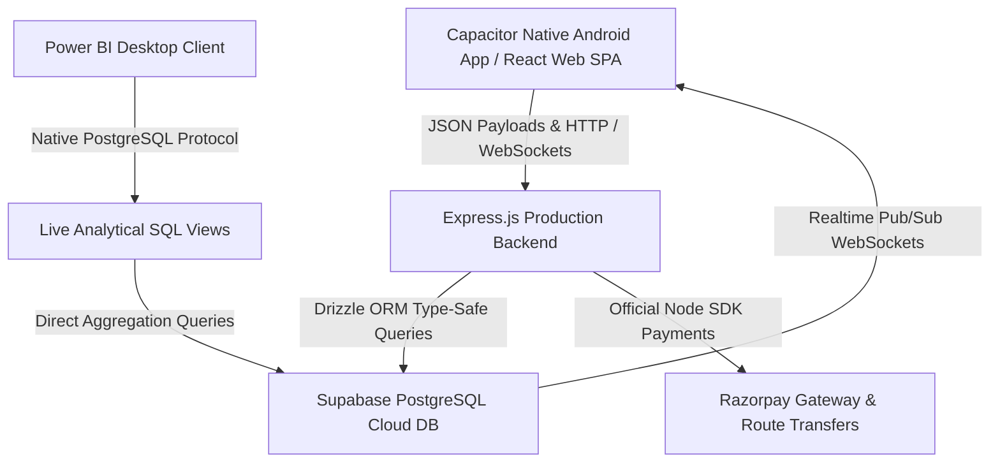

# 🏛️ OmniBid India: The Universal Escrow & Bidding Platform

OmniBid India is a premium, high-performance, sector-agnostic B2B and B2C marketplace designed for the modern Indian economy. Anchored on the philosophy that **"Everything can be bidded"**, OmniBid transitions traditional transaction models into a unified, secure, bidding ecosystem. From large-scale civil construction contracts and logistics lines to high-tech software engineering, corporate legal consulting, and local gig work, OmniBid guarantees transactional trust and financial security.

---

## 🚀 Business Vision: "Everything Can Be Bidded"

OmniBid represents a structural moat in marketplace architecture, dissolving industry-specific barriers to operate as a completely **universal, sector-agnostic bidding ecosystem**.

*   **Universal Bidding Engine:** Allows any organization or individual to post a requirement, establish price floors/ceilings, and invite competitive bids.
*   **The Escrow Trust Protocol:** All winning bids are secured in a multi-party escrow system using Razorpay Sandbox implementations, locking funds dynamically in the active trust pool.
*   **Arbitration & Disputes Safeguard:** A built-in 5% dispute threshold mechanism freezes escrowed capital in the event of milestone deviations, routing arbitration directly to platform administrators.
*   **Unlimited Vertical Scaling:** Whether contracting for a ₹50,00,000 RCC building project in Hyderabad, hiring a Flutter developer in Bengaluru, booking a container shipment from Mumbai Port, or retaining a corporate auditor for GST filings, OmniBid operates seamlessly under a single transaction protocol.

---

## 🛠️ High-Performance Architecture

OmniBid is structured as a monorepo leveraging a cutting-edge JavaScript/TypeScript ecosystem for zero-overhead performance, modular scaling, and type safety.



### 💻 Technology Stack
*   **Frontend (@omnibid/client):** Premium Single Page Application (SPA) built using **React 19**, **Vite**, **TypeScript**, and interactive animations powered by **Framer Motion** and **Lucide Icons**.
*   **Backend (@omnibid/server):** Optimized **Express.js** engine enforcing modular API routing, global raw body buffering for cryptographic payload validation, and custom Pino logging.
*   **Database & ORM (@omnibid/db):** **Drizzle ORM v0.45** mapping **21 unified tables** with type-safe schema declarations. Powered by **Supabase PostgreSQL** hosted on **AWS ap-southeast-2 (Sydney)** with connection poolers.
*   **Payments & Escrow:** Official **Razorpay Node SDK** routing deposits into secure holding accounts and automating milestones disbursement to freelancer linked accounts using **Razorpay Route**.
*   **Mobile Wrapper:** **Capacitor Mobile Wrapper** packaging the web SPA's production bundle directly into a native Android app wrapper.

---

## ⚡ Dynamic Scaling via JSONB Payloads

Traditional databases require schema migrations and table additions for every new marketplace vertical. OmniBid solves this structural challenge using high-performance **PostgreSQL JSONB storage**.

In our database schemas, the core `requirements` table contains a schema-less `custom_data` (represented as `customData` in Drizzle) JSONB column:

```typescript
export const requirementsTable = pgTable("requirements", {
  id: uuid("id").primaryKey().defaultRandom(),
  buyerId: uuid("buyer_id").notNull().references(() => usersTable.id),
  categoryId: uuid("category_id").notNull().references(() => categoriesTable.id),
  title: text("title").notNull(),
  description: text("description").notNull(),
  customData: jsonb("custom_data"), // <-- Dynamic Industry Payload
  // ... other core columns
});
```

### Dynamic Mapping Across Industries:
*   **IT & Software:**
    ```json
    {
      "techStack": ["React", "Node.js", "TypeScript", "PostgreSQL"],
      "preferredExperience": "5+ years",
      "timelineMonths": 3,
      "repositoryAccessRequired": true
    }
    ```
*   **Civil & Construction:**
    ```json
    {
      "scope": "RCC structural execution, brickwork, and plastering",
      "materialsRequired": true,
      "builtUpAreaSqFt": 4500,
      "architecturalDrawingApproved": true
    }
    ```
*   **Logistics & Freight:**
    ```json
    {
      "origin": "Mumbai",
      "destination": "Bengaluru",
      "tonnage": 15,
      "vehicleType": "16-wheeler container truck",
      "transitInsuranceRequired": true
    }
    ```
*   **Corporate Legal:**
    ```json
    {
      "type": "Corporate GST compliance auditing and filing retainer",
      "regulatoryBodies": ["GSTN", "CBIC"],
      "complianceStandard": "ISO-27001",
      "retainerBasis": false
    }
    ```

This architectural decision allows the frontend to dynamically render vertical-specific forms and metadata cards based on the selected category, enabling **limitless vertical expansion without database drift**.

---

## 🔒 Security, RLS, and KYC Compliance

OmniBid implements strict enterprise-grade security protocols to protect transactions and lock down data:

### 1. Row-Level Security (RLS) Lockdown
Supabase RLS is configured to restrict unauthorized operations. Users are compartmentalized within strict tenant-like isolations:
*   **Users Table:** Users can only view or update their own profile records.
*   **Requirements Table:** Open requirements are publicly readable, but write/update access is strictly restricted to the owning Buyer.
*   **Bids Table:** Open bids are only visible to the requirement owner (Buyer) and the placing Provider, preventing competitive bid sniping.
*   **Payments & Disputes:** Fully isolated—only the active Buyer or Provider participating in the escrow transaction can view payment/dispute details.

### 2. Aadhaar & PAN DigiLocker KYC
To establish high trust scores, providers undergo DigiLocker KYC verification:
*   Submits biometric/credential parameters (Aadhaar or PAN) through a secure endpoint.
*   Verifies identity via mock integrations, setting `kycStatus` to `'verified'` and generating a `razorpayLinkedAccountId` to enable automated disbursements.

---

## 📊 Business Intelligence & Power BI Integration

The database is equipped with three highly optimized pre-aggregated SQL Views to feed Power BI dashboards dynamically, adapting to any new verticals added to the platform:

1.  **`vw_platform_financials`**: Tracks gross transactional statistics, GTV, platform fees collected, Indian TDS withheld, and net provider payouts monthly.
2.  **`vw_sector_analytics`**: Measures listing counts, price averages, and competitive "Bid Density" across all categories.
3.  **`vw_trust_and_disputes`**: Measures escrow dispute rates and aggregates locked/frozen trust capital by sector.

*(For detailed schema definitions of these views, refer to the [DATA_DICTIONARY.md](file:///DATA_DICTIONARY.md)).*

---

## 🚀 Local Development Setup

To run the OmniBid monorepo locally, follow these instructions:

### Prerequisites
*   Node.js v20+
*   pnpm v9+ (or use `npx pnpm`)

### 1. Install Dependencies
```bash
npx pnpm install
```

### 2. Configure Environment Variables
Create a `.env` file in the monorepo root:
```env
DATABASE_URL="postgresql://<username>:<password>@<host>:6543/postgres?sslmode=require"
```

### 3. Run Development Servers
```bash
# Run both Backend API (Port 3001) and Frontend Web SPA (Port 3000)
npx pnpm run dev
```

### 4. Execute the Database Seeder
To repopulate the live Supabase instance with 7,340 relational mock records:
```bash
$env:NODE_TLS_REJECT_UNAUTHORIZED="0"; npx pnpm --filter @omnibid/server run db:seed
```
