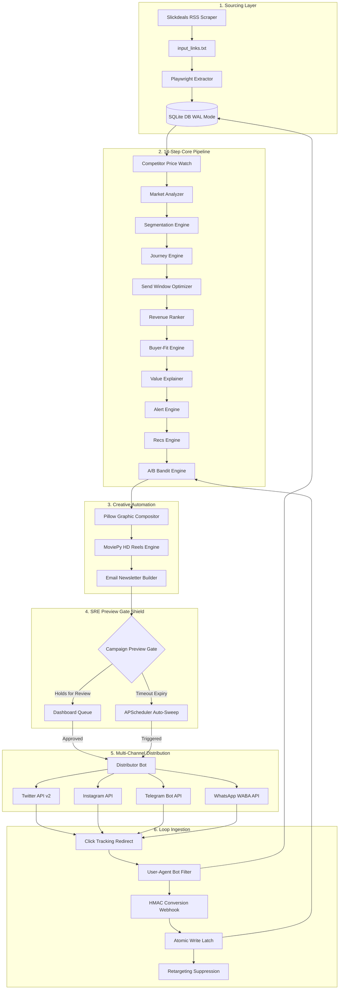

# 🚀 Zero-Marginal-Cost Autonomous Affiliate Marketing Suite

[]()
[]()
[]()
[]()

An enterprise-grade, fully autonomous, and zero-marginal-cost affiliate marketing machine. The suite automates the entire product marketing lifecycle: live trending deal sourcing, multi-layered SRE pre-flight evaluation, Ken Burns dynamic HD reels rendering, copywriting composition, multi-channel broadcast (Telegram, X, Instagram, WhatsApp WABA), A/B multi-armed bandit learning, and HMAC-protected atomic conversion tracking.

---

## 🏛️ System Architecture



---

## 🛠️ The Tech Stack

*   **Application Core**: Python 3.11 / Flask (Session-Backed authentication, Rate-Limiting, Global CSRF)
*   **Database Subsystem**: SQLite3 tuned in **WAL Mode** (Write-Ahead Logging) executing explicit atomic `BEGIN IMMEDIATE` write locks.
*   **Content Scrapers**: Python `xml.etree` & Playwright (Stealth evasion, HTTP header sanitization).
*   **Asset Creators**: Pillow (Graphic composition, fallback rendering) & MoviePy / gTTS (Audio-visual vertical reels compiler).
*   **Distributors**: Outbound broadcast adapters wrapping live Tweepy SDK, Meta Graph REST interfaces, and Telegram Telegram Bot APIs.
*   **SRE Subsystem**: Persistent state-machine Circuit Breakers, daily Quota Caps, thread-pool resilient timeouts, and SHA-256 event-fingerprint Idempotency Locks.
*   **Learning Engine**: Epsilon-Greedy A/B Multi-Armed Bandit model calculating variant performance from atomic conversion events.

---

## ⚡ Core Pillars & Capabilities

### 1. Live Sourcing & Competitive Sifting
Sourcing operates on Slickdeals Popular Deal RSS feeds, fetching items using resilient XML and string-fallback Regex scrapers. Sourced links are passed to Playwright to extract real-time details (merchant stock, prices, title, and ratings), compiling details against concurrent competitor listings to establish market-cheapest verifications.

### 2. High-Conversion Creative Generation
*   **Visual Graphic Compositor**: Renders harmoniously blended, curatively styled marketing graphics combining merchant thumbnail layers, badges, price stamps, and sector borders.
*   **Vertical Reels Video Engine**: Assemblesvertical (9:16) H.264 vertical videos matching Pillow zoom panning (Ken Burns effect) with custom Google TTS vocal tracks, Hook titles, CTA buttons, and glowing progress indicators.
*   **Copywriting Generator**: Generates Hindi, Tamil, and English marketing captions injected with compliant FTC promotional disclosures.

### 3. Stateful Site Reliability Engineering (SRE) Shield
*   **SQLite Circuit Breakers**: Stateful database breakers monitor `gemini`, `telegram`, `playwright`, `twitter`, `instagram`, and `whatsapp` API calls. Tripped circuits auto-isolate API pipelines and fall back to local mocks.
*   **Daily Quota Caps**: Enforces rigorous daily warning and hard-blocking caps on external providers, mitigating credit depletion.
*   **resilience Engine**: Wraps concurrent thread-pool timeouts and randomized jitter retry backoffs.
*   **Idempotency locks**: Latch processes with SHA-256 request hashes, avoiding double-execution.

### 4. Dynamic Operator Dashboard & Preview Gate
Sourced products are locked in the `pending_approval` queue. Operators view multi-lingual content, countdown auto-publishing timers, and SRE health indicators inside a Glassmorphic responsive panel, overriding runs or approving distributions in one click. 

### 5. HMAC Atomically Hardened Webhooks
Postbacks verify affiliate conversion triggers. The route computes HMAC-SHA256 signatures, logging transactions atomically in a three-stage `BEGIN IMMEDIATE` database write sequence (Insertion, Conversion state-transition, and Retargeting Suppression exclusion). The exclusion immediately hides converted buyers from dynamic retargeting campaigns.

---

## 💾 Local Installation & Setup

1.  **Clone the Repository**:
    ```bash
    git clone https://github.com/YourAgency/affiliate-marketing-suite.git
    cd affiliate-marketing-suite
    ```

2.  **Configure Virtual Environment**:
    ```bash
    python -m venv venv
    ./venv/Scripts/activate      # On Windows
    source venv/bin/activate    # On Unix/macOS
    ```

3.  **Install System Dependencies**:
    ```bash
    pip install -r requirements.txt
    playwright install
    ```

4.  **Populate Local Environment (`.env`)**:
    Create a `.env` file matching `.env.example`:
    ```env
    PORT=5000
    ADMIN_DEFAULT_PASSWORD=admin123
    TELEGRAM_BOT_TOKEN=your_telegram_bot_token_here
    TELEGRAM_CHAT_ID=your_telegram_chat_id_here
    TWITTER_API_KEY=your_twitter_api_key_here
    ...
    ```

5.  **Initialize Schemas & Seed Users**:
    ```bash
    python bots/db_manager.py
    ```

6.  **Run the Diagnostic Health Check**:
    ```bash
    python tests/final_e2e_check.py
    ```

7.  **Launch Web Application**:
    ```bash
    python app.py
    ```
    Access the admin control center at: `http://127.0.0.1:5000`

---

## 🌐 Enterprise VPS Deployment

### 1. Concurrency Constraint: Gunicorn Singleton
To prevent multiple APScheduler workers from instantiating and firing duplicate social campaigns, Gunicorn **must** be constrained to a single worker process running multi-threaded:
```bash
# Start Gunicorn binding on localhost port 5000
gunicorn --workers 1 --threads 4 --bind 127.0.0.1:5000 app:app
```

### 2. Reverse Proxy: Caddyfile Configuration
Deploy Caddy on Ubuntu to act as a secure reverse proxy handles automated SSL certifications:
```caddy
affiliate.yourdomain.com {
    reverse_proxy 127.0.0.1:5000
    
    # Custom headers for SRE rate-limiting remote IP tracking
    header_up X-Real-IP {remote_host}
    header_up X-Forwarded-For {remote_host}
}
```

### 3. Background Services Daemon (systemd)
Create `/etc/systemd/system/affiliate.service` to daemonize execution:
```ini
[Unit]
Description=Zero-Marginal-Cost Affiliate Suite Gunicorn Daemon
After=network.target

[Service]
User=www-data
WorkingDirectory=/var/www/marketing
EnvironmentFile=/var/www/marketing/.env
ExecStart=/var/www/marketing/venv/bin/gunicorn --workers 1 --threads 4 --bind 127.0.0.1:5000 app:app
Restart=always
RestartSec=5

[Install]
WantedBy=multi-user.target
```
Start the service daemon:
```bash
sudo systemctl daemon-reload
sudo systemctl enable --now affiliate.service
```

---

🏆 **Final Assessment: Operational verification completes successfully. Deployed cleanly with single-worker thread pool systemd parameters.**
