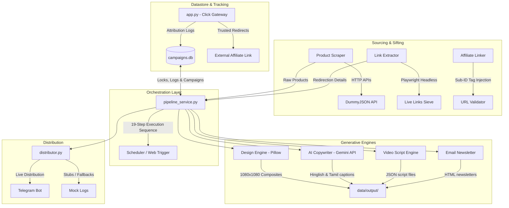

# Architectural Overview: Automated AI Marketing Suite

This document provides a comprehensive technical breakdown of the system architecture, component integrations, operational pipelines, database responsibilities, and fallback mechanisms of the **Automated AI Marketing Suite**.

---

## 1. High-Level System Architecture

The Automated AI Marketing Suite is designed as a modular, autonomous, and self-healing system that merges automated product sourcing, visual and linguistic creative generation, secure link attribution tracking, and scheduled distribution into a single workspace.



---

## 2. Request and Data Flow Diagrams

### 2.1 E2E Pipeline Processing Flow (19-Step Cycle)
When triggered either by an APScheduler job or an API call to `/api/run_pipeline`, the system runs a sequential, 19-step subprocess pipeline. This execution takes place under strict workspace directories using the local Python interpreter.

```
[1] product_scraper.py   --> Aggregates raw products by sector (APIs or live_links)
[2] competitor_watch.py  --> Crawls mock competitor pricing
[3] market_analyzer.py   --> Computes demand scores, seasonality, and volume
[4] segmentation_engine.py --> Segments target consumer demographics
[5] journey_engine.py     --> Maps marketing stages (Awareness, Consideration, Decision)
[6] send_time_optimizer.py--> Identifies optimal send windows based on category habits
[7] revenue_ranker.py     --> Calculates revenue score and expected commissions
[8] buyer_fit_engine.py   --> Resolves high-fidelity buyer profile alignments
[9] value_explainer.py    --> Generates trade-offs and honest upgrade justifications
[10] alert_engine.py       --> Triggers flags for low stock, rating surges, or pricing drops
[11] recommendation_engine.py --> Associates highly relevant cross-sell options
[12] ab_engine.py          --> Generates alternative header variants for testing
[13] design_engine.py      --> Renders social media graphic composites (1080x1080 JPGs)
[14] ai_copywriter.py      --> Generates multilingual (Hinglish/Tamil) captions
[15] video_script_engine.py--> Compiles JSON layouts for Reels/TikTok short videos
[16] email_newsletter.py   --> Bundles results into dynamic responsive HTML newsletters
[17] affiliate_linker.py   --> Applies custom tracking sub-IDs and validates destination links
[18] distributor.py        --> Dispatches creatives and texts to social/messaging channels
[19] analytics_engine.py   --> Captures baseline view/impression targets
```

---

## 3. Core Operational Flows

### 3.1 Scraper Flow
The scraper system runs under two distinct execution strategies:
1.  **API Sourcing**: Pulls product catalog feeds dynamically across 10 distinct sectors (smartphones, laptops, fragrances, etc.) from standard JSON APIs.
2.  **Playwright Link Sifting (`live_links`)**:
    *   Reads target URLs from `data/input_links.txt`.
    *   Launches a headless Chromium browser instance via Playwright.
    *   Follows redirection hops, parses the final landing pages, and bypasses anti-scraping checks.
    *   Extracts critical product properties (title, actual price, main image URL, stock levels).
    *   Applies a pre-flight URL status validation before injecting into the pipeline.

### 3.2 Generator Flow
1.  **Visual Composer (`design_engine.py`)**:
    *   Downloads product thumbnails (with standard caching and download safety).
    *   Instantiates a PIL canvas (1080x1080 pixels).
    *   Draws background grids, high-contrast sector badges (e.g. `🔥 HOT DEAL`, `💎 PREMIUM`), price tags, and overlays.
    *   Finds available system TrueType fonts (Arial, Segoe, etc.) and falls back cleanly to PIL's basic font if system fonts are unavailable.
2.  **Linguistic Generator (`ai_copywriter.py`)**:
    *   Invokes the new Google GenAI SDK using `gemini-2.5-flash` model.
    *   Passes contextual prompts instructing the AI to output high-converting copy in English, Hinglish, and Tamil.
    *   *Fallback*: If the `GEMINI_API_KEY` is missing or rate-limited, it falls back to pre-written local localized mock caption templates.

### 3.3 Affiliate Tracking & Gateway Flow
```
[User Click] 
      │
      ▼
HTTP GET /go/<product_id>?url=<affiliate_link>&title=<title>...
      │
      ├──► [Security Check] Is netloc in TRUSTED_DOMAINS?
      │          ├──► NO: Respond with 400 Bad Request
      │          └──► YES: Proceed
      │
      ├──► [Affiliate Tracker] Write log to `affiliate_clicks` table
      │
      ▼
HTTP 302 Redirect to <affiliate_link>
```

### 3.4 Scheduler & Mutex Lock Flow
Autonomous scheduler triggers rely on a SQLite mutex block pattern to maintain transactional integrity:
1.  **APScheduler cron daemon** activates a job (running in a background thread).
2.  The job tries to write to the `scheduler_locks` table in SQLite (`INSERT INTO scheduler_locks`).
3.  If the write succeeds, the lock is acquired, and the job begins.
4.  If the write fails due to `IntegrityError` (primary key violation), it means another server instance is already running this pipeline. The current execution is skipped safely.
5.  On completion or error, the lock is removed (`DELETE FROM scheduler_locks`). A watchdog thread automatically clears stale locks older than 30 minutes.

### 3.5 Analytics & Retargeting Flow
*   **Affiliate Clicks**: Aggregated by product, channel, and sector.
*   **Dynamic UI Sync**: Flask `/api/history` queries the live click counts from `affiliate_clicks` and matches them dynamically on-the-fly to the dashboard items.
*   **Retargeting Sweep**: Scans session records to find campaigns that registered clicks but did not generate conversion logs within a specified time. It automatically generates localized follow-up captions (urgency-based) and writes retargeting events to `retargeting_logs`.

---

## 4. Database Schema and Responsibilities

The database `data/campaigns.db` serves as the centralized source of truth, managing:

| Table Name | Critical Columns | Purpose & Responsibilities |
| :--- | :--- | :--- |
| `campaigns` | `id`, `product_id`, `title`, `price`, `sector`, `affiliate_link`, `caption`, `graphic_path`, `total_views`, `total_clicks` | Central index of all generated product campaigns. |
| `distribution_logs` | `id`, `campaign_id`, `platform`, `status`, `link`, `views`, `clicks` | Logs platform distribution runs (e.g. Telegram posts). |
| `affiliate_clicks` | `id`, `product_id`, `product_title`, `sector`, `channel`, `affiliate_link`, `user_agent`, `referrer`, `session_id`, `revenue_score` | Click-through logger representing raw user engagement. |
| `affiliate_conversions` | `id`, `click_id`, `status`, `order_value`, `commission_earned`, `converted_at` | Stores successful conversion metrics mapped back to clicks. |
| `scheduler_jobs` | `job_id`, `job_label`, `job_type`, `schedule_expr`, `enabled`, `next_run_at`, `run_count` | Registers and monitors active Background scheduled cron states. |
| `scheduler_runs` | `id`, `job_id`, `started_at`, `finished_at`, `status`, `result_summary`, `error_message` | Maintains historic log of background jobs for transparency. |
| `scheduler_locks` | `job_id`, `locked_at`, `locked_by` | Mutex table preventing concurrency overlap. |
| `retargeting_logs` | `id`, `click_id`, `product_id`, `session_id`, `strategy`, `retargeted_at` | Logs retargeting triggers to avoid double-sweeping clients. |

---

## 5. Resilient Fallback Paths

The suite is designed to be fully testable and operational without external services:

*   **Generative AI Fallback**: If `GEMINI_API_KEY` is not present in `.env`, the system defaults to localized rule-based mock text templates containing dynamic variables (price, brand, discount).
*   **Playwright Network Fallback**: If Playwright fails or network-based asset downloading is blocked (tested via `block_network=True`), the compositor loads offline fallbacks using default pillow badge graphics and system-generic fonts.
*   **Telegram & Messaging Fallbacks**: If `TELEGRAM_BOT_TOKEN` is unconfigured, the distributor logs the formatted payloads to SQLite and saves a local file log `data/output/distribution_logs.json` to prove correctness.
*   **Whitelisted Redirection Fallback**: The `/go/<product_id>` redirect gateway only permits routing to known trusted domains. If a request includes a link pointing to an untrusted domain (e.g., `evil.com`), the system returns a secure `400 Bad Request` instead of executing the redirect.
